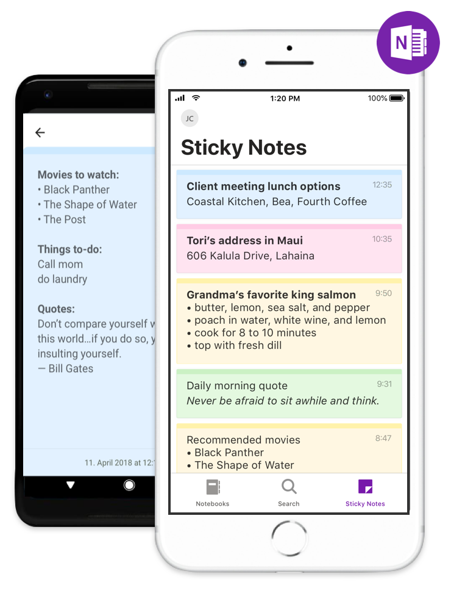
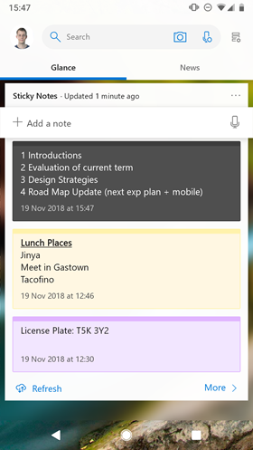

#  Take your Sticky Notes with you

You can now access all your Sticky Notes through the OneNote app on your iPhone or Android device. Take a quick note on the go and it will sync back to your Windows machine. Never lose track of that thought or idea no matter where you are.

[iOS](https://www.microsoft.com)
[Android](https://www.microsoft.com)

 

# Get Sticky Notes on the go with Microsoft Launcher

With Microsoft Launcher, you can personalize your Android device to match your style with wallpapers, theme colors, icon packs and more. With a Microsoft account or work/school account, you can access your calendar, documents, Sticky Notes and recent activities in your personalized feed. 

 

# Help us improve Sticky Notes

We believe that the customer comes first. If you think there is a way we can make Sticky Notes even better, or if you want to tell us how you use Sticky Notes: head over to [uservoice]. We'd love to hear from you.