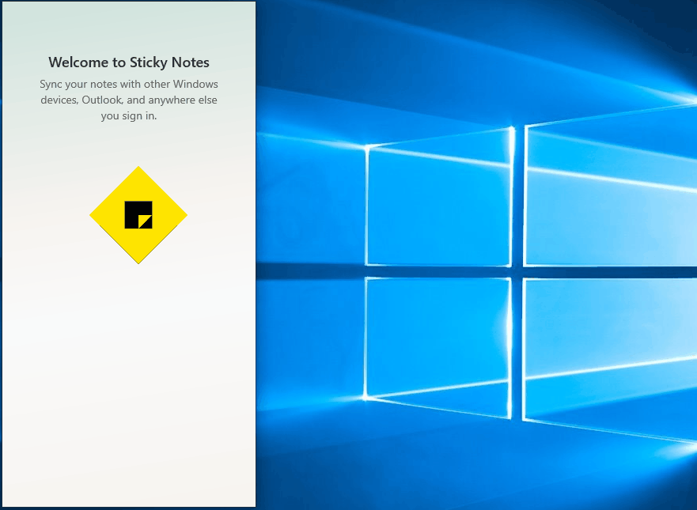
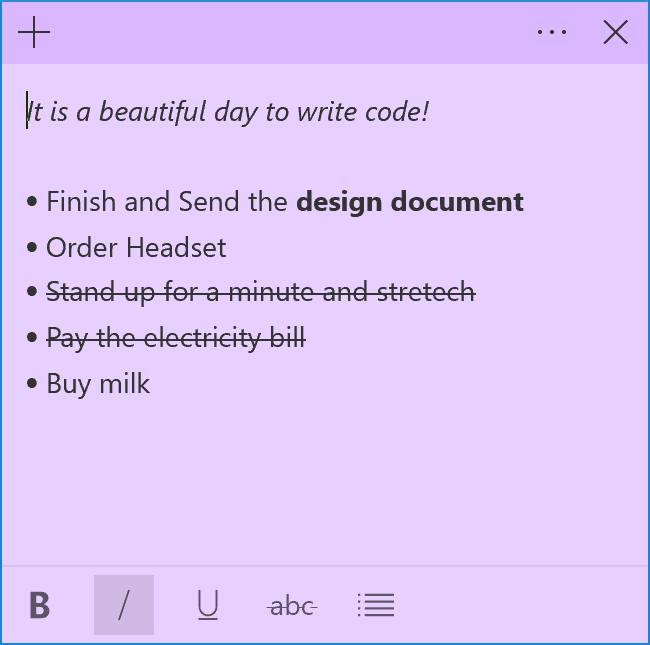

# Microsoft Sticky Notes 3.0 Release Notes

* Sync (& backup) your notes across your Windows devices.

* If you have a lot of notes, your desktop can get a bit crowded! We are introducing a new home for all your notes. You can choose which notes to stick to your desktop or tuck them away and find them again easily with search.
* Before all the beautiful sunshine arrived, we channeled our dark energy into a dark themed note: Charcoal Note.
* Crossing tasks off feel better than deleting them! Now you can style your note with the new formatting bar.

* You may notice that Sticky Notes is performing a lot faster – that is completely on purpose.
* We’ve applied so much polish that the app is starting to look like a shiny pony!
* Drastic improvements on being more inclusive:
    * Using assistive technologies and Narrator.
    * Keyboard navigation.
    * Using mouse, touch, and pen.
    * High Contrast.

