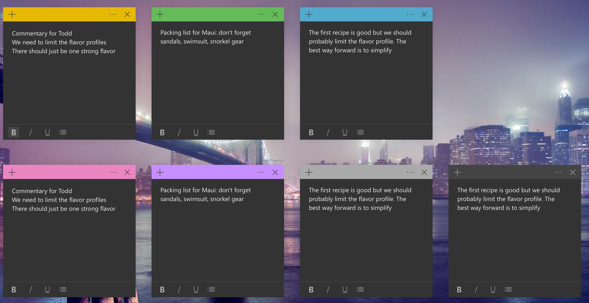
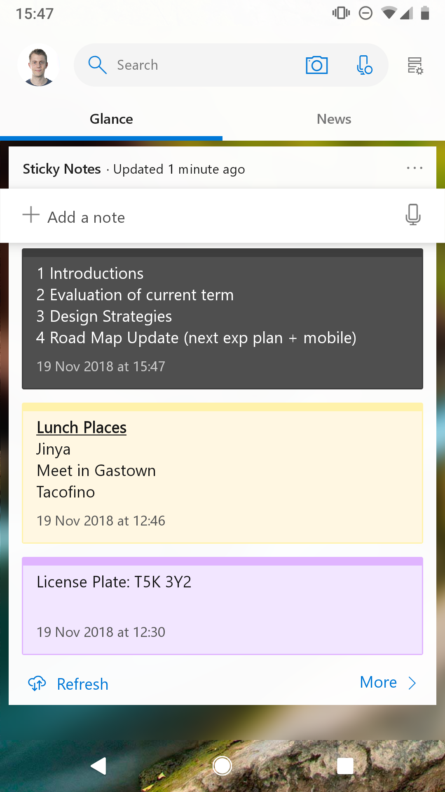
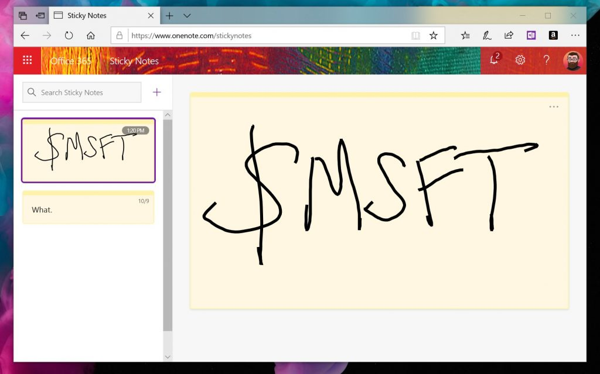

# Microsoft Sticky Notes 3.1 Release Notes

Over the last couple of weeks, we’ve been testing an update to Sticky Notes in Skip Ahead. Today, we’re excited to announce that we’re rolling out that major update to everyone on Windows version 1809 and higher!
 

A few highlights in this version:
 
* We tested the waters with the Charcoal Note, and you all seemed keen to go even darker!  Introducing full-on Dark Mode support in Sticky Notes. We support Windows Dark Mode as well as the ability to set your color mode in Sticky Notes to suit your mood independent of your system settings.
* Everyone seemed excited about Sticky Notes syncing, so we spent some time making it even faster and more reliable! Check it out and let us know how it feels.

  
Give it a shot and let us know how it feels via Feedback Hub. 😊
 
On your Android devices 
It has never been easier to access your Sticky Notes and Microsoft To-Do on your Android devices. Thanks to some help from our friends on the Launcher team, your Sticky Notes are available now on Microsoft Launcher Beta. 

     
Your notes everywhere
Want to get to your notes from anywhere? How about on the web at http://www.onenote.com/stickynotes? Take a look and let us know what you think.

  
Meet the team
We had a great time working with the Insiders folks to have an interactive webcast with some of you this month.  In case you weren’t able to attend, you can watch the video on [Windows Insider's Mixer Channel](https://mixer.com/WindowsInsider?vod=67065153).
 
We hope you love this update as much as the last one.  If you do (or don’t!), don’t hesitate to drop us a line and share your feedback on the Feedback Hub.  
